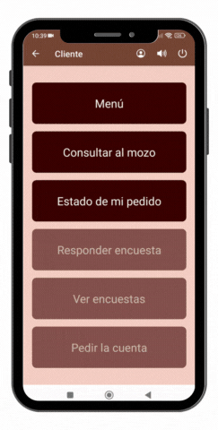
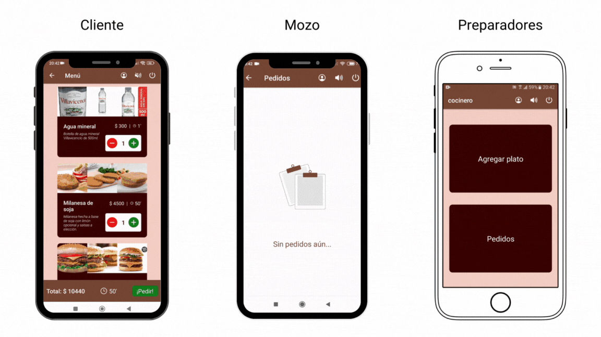
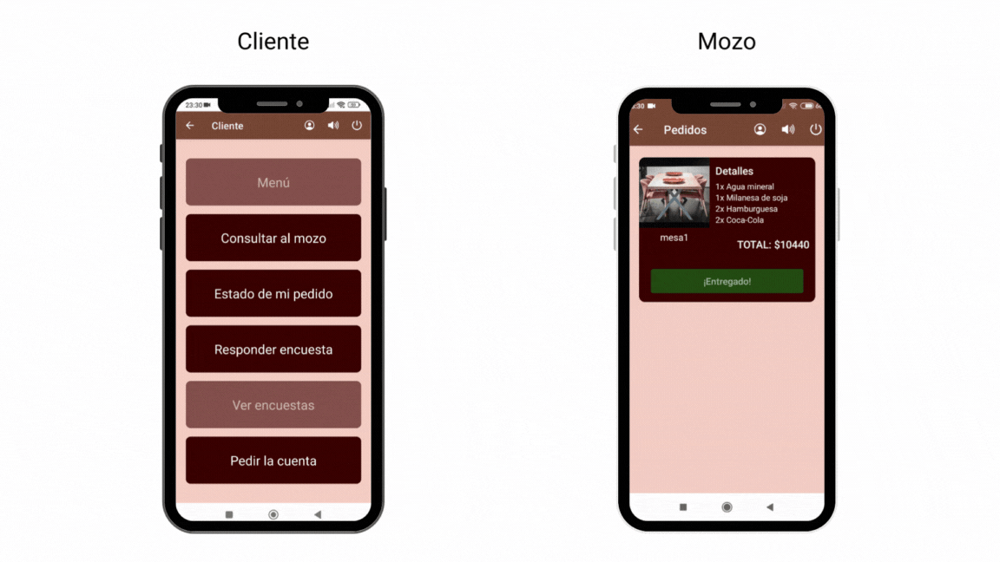
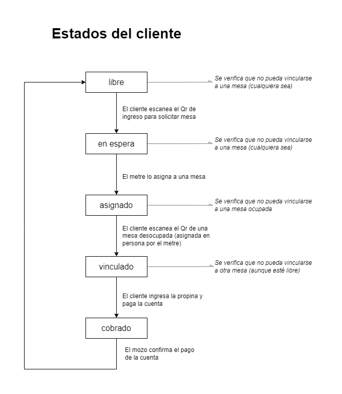
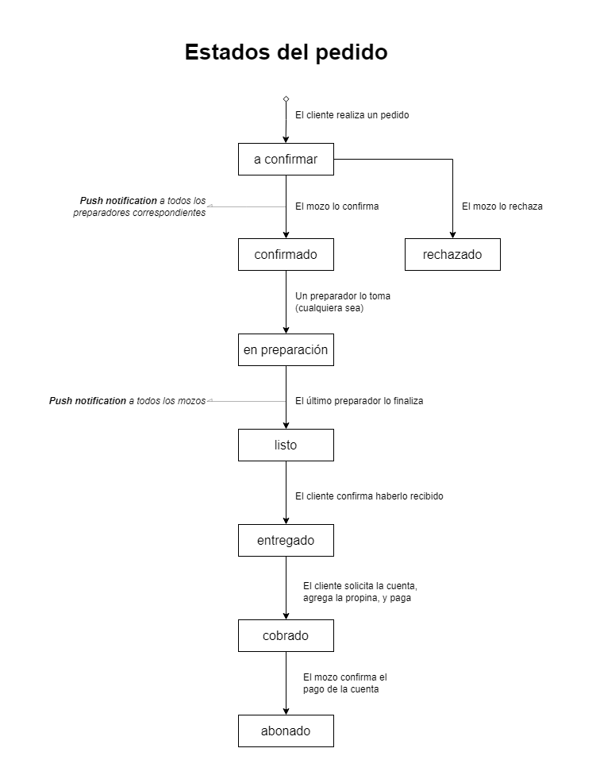
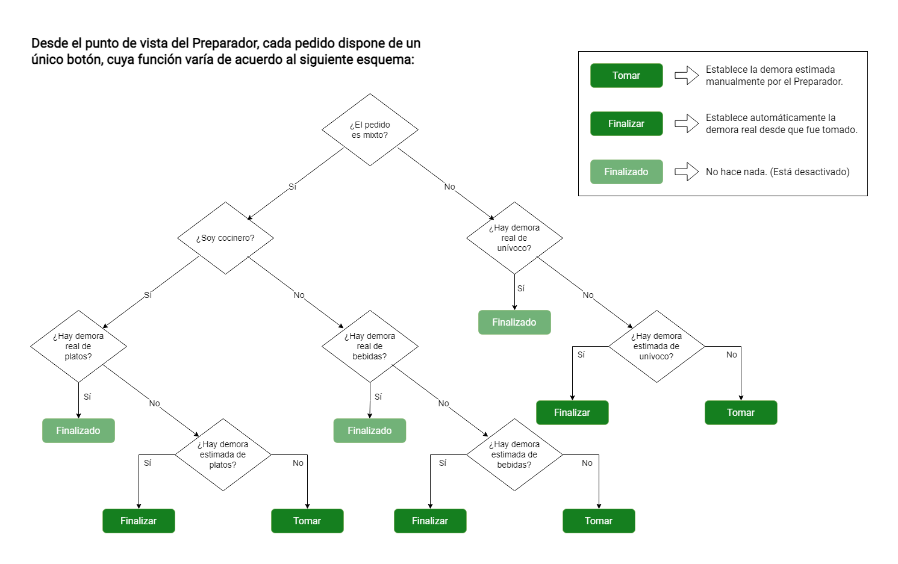
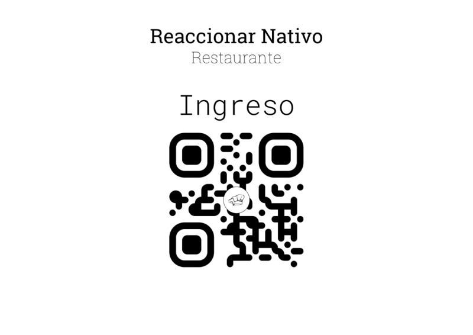
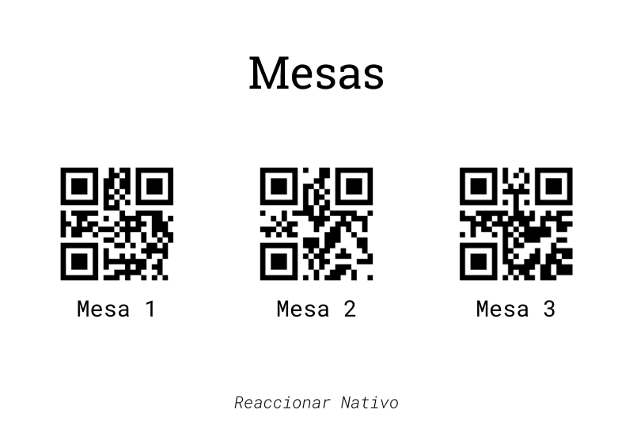
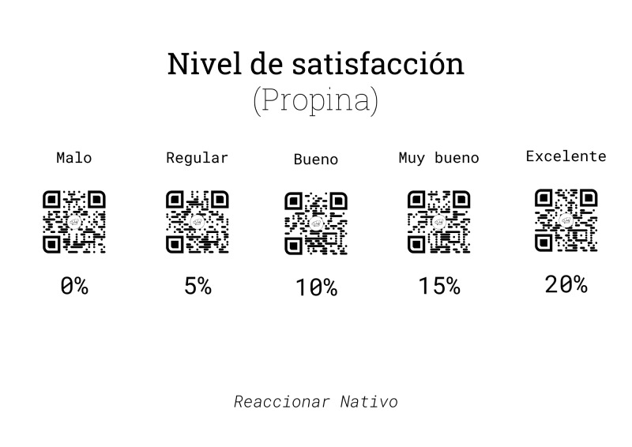

# :fork_and_knife: Reaccionar Nativo :electron:

## :wave: Bienvenida

**¡Hola!**

Somos un restaurante especializado en comidas típicas argentinas, reputado no solo gracias a la calidad de nuestros platos y bebidas, sino también a nuestro servicio digital de atención al cliente.

Con nuestra aplicación, desde el instante 0 podrás escanear el código Qr en la puerta de ingreso de cualquiera de nuestros locales, para, así, acceder a las reseñas, solicitar una mesa, pedir cualquier plato, bebida o postre que haya en la carta, y seguir el estado de tu pedido **en todo momento.**

Además, vas a poder chatear con el mozo, pedir la cuenta, y compartirnos tu opinión respecto de la atención recibida. ¡Todo sin moverte del asiento, a través de tu celular!

¿Qué estás esperando? Viví la nueva experiencia gastronómico-digital: ¡Viví el Reaccionar Nativo!
 
 

## :arrow_forward: Demo

### Realizar un pedido:

 
 

### Preparar pedido (3 celulares en simultáneo):

 
 

### Pedir la cuenta y pagar (2 celulares en simultáneo):

 
 

## :pencil2: Diagramas

#### Clientes:

#### Pedidos:

#### Elaboración:

 
 

## :printer: Códigos Qr's

#### Ingreso:

#### Mesas:

#### Propinas:

## :clipboard: Objetivos

### Guía:

:heavy_check_mark: = REALIZADO

:clock2: = POSPUESTO

:x: = CANCELADO
 
 

### :calendar: Semana 1 (15/10 - 22/10):

- **Catania Franco**
  - Alta de dueño / supervisor (Administrador) :heavy_check_mark:
  - Alta de clientes :heavy_check_mark:
  - Botón de sonido (activar/desactivar) :clock2:
  - Qr de ingreso al local (auxiliar) :heavy_check_mark:
  - Qr de mesa (auxiliar) :heavy_check_mark:

- **Cantero Agustín**
  - Envío automático de correos electrónicos :clock2:

- **Arismendy Herik**
  - Ícono de la aplicación :heavy_check_mark:
  - Splash screen animado :heavy_check_mark:
  - Spinner de la empresa :heavy_check_mark:
  - Sonidos de inicio y de cierre :heavy_check_mark:

### :calendar: Semana 2 (22/10 - 29/10):

- **Catania Franco**
  - Ingreso y asignación de mesas :heavy_check_mark:
  - Íconos de usuarios (perfiles) :heavy_check_mark:
  - Estados del pedido :clock2:

- **Cantero Agustín**
  - Envío automático de correos electrónicos :heavy_check_mark:
  - Primeros push notifications :clock2:

- **Arismendy Herik**
  - Encuesta de clientes (diseño) :heavy_check_mark:
  - Encuesta de clientes (lógica) :clock2:
  - Gráficos estadísticos (clientes) :clock2:

### :calendar: Semana 3 (29/10 - 5/11):

- **Catania Franco**
  - Botón de sonido (activar/desactivar) :heavy_check_mark:
  - Elaborar y confirmar pedidos :heavy_check_mark:
  - Push a todos los mozos cuando el pedido está listo :clock2:
  - Mejorar contraste de los mensajes de información al usuario :heavy_check_mark:
  - Solicitar la cuenta y pagar :heavy_check_mark:

- **Cantero Agustín**
  - Confirmar contraseña en registro de cliente :heavy_check_mark:
  - Qr's de propinas (de 0% a 20%) :heavy_check_mark:
  - Persistencia de la sesión del usuario :heavy_check_mark:
  - Sonido de las notificaciones :clock2:
  - Push al administrador cuando un cliente se registra :heavy_check_mark:

- **Arismendy Herik**
  - Qr de ingreso (ahora con encuestas) :heavy_check_mark:
  - Encuesta de clientes (completa) :heavy_check_mark:
  - Gráficos estadísticos (clientes) :heavy_check_mark:
  - Push al metre cuando el cliente solicita una mesa :heavy_check_mark:
  - Push a cada sector cuando el mozo confirma un pedido :heavy_check_mark:
  - Vibraciones al detectarse un error :heavy_check_mark:

### :calendar: Semana 4 (5/11 - 12/11):

- **Catania Franco**
  - Generar pedidos escaneando Qr's de productos :x:
  - Push a todos los mozos cuando el pedido está listo :heavy_check_mark:
  - Push a todos los mozos cuando el cliente hace una consulta :heavy_check_mark:
  - Correcciones generales :heavy_check_mark:

- **Cantero Agustín**
  - Sonido de las notificaciones :x:
  - Sección "Perfil" para todos los usuarios :heavy_check_mark:
  - Alta de empleados: ahora se puede subir después la foto :heavy_check_mark:

- **Arismendy Herik**
  - ABML de productos :x:
  - Corrección de todas las pantallas en blanco :heavy_check_mark:
